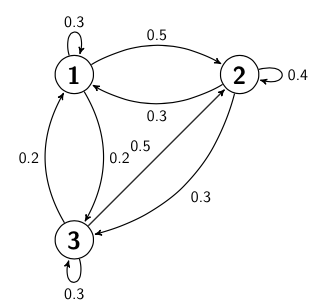

# Sampling the stationary distribution

Consider the Markov chain with the transition graph shown below:

All the states in this chain are recurrent.  If you leave any one state there is a guarantee that you will return to it again at some point in the future.  We can thus run the Markov chain for a certain amount of time and calculate the fraction of time that is spent in each of the three states.  The fraction of time that the chain spends in each state is an estimate of a quantity known as the stationary distribution of this Markov chain.  In this exercise we are thus going to learn how to estimate this stationary distribution by sampling the chain.

I would recommend that you start writing this function by noting that the transition matrix that corresponds to the chain above is:

You can thus set a variable `A` equal to this matrix by using the `np.array` command that was introduced in previous exercises.  Having doesn this you can then write a function called `markov_move` for generating the next state in a Markov chain. Just as in the previous exercises this function takes two arguments. The first of these arguments, `trans`, should be the 1-step transition matrix for the Markov chain that is being simulated. The second argument, `start`, is the state that the system is currently within. Your function should generate the next state in the chain.

You can call ths `markov_move` function repeatedly and thus generate a Markov chain that samples the above transition matrix.  Much as you have learned to do when calculating histograms you can setup a vector to keep track of the number of visits to each of the states in the chain.  In other words, you can run the chain for `nsteps` steps and count the number of times the chain visits each state in a 3 dimensional vector.  If you then divide this 3 dimensional vector by `nsteps` what you have is an estimate of the stationary distribution.

With that in mind, I want you to use the ideas that I have explained above to generate and plot an estimate of the stationary distribution for the Markov chain with the transition graph and transition matrix that I have provided above.  You should plot a bar chart in which the heights of the bars are the estimates for the elements of the stationary distribution that you get by sampling.   These x-coordinates of the bars should at 1, 2 and 3 and the x-axis label in your graph should be "state". The y-axis label should then be "probability".  Furthermore, as has already been discussed the bars should have heights that correspond to the fraction of the `nsteps` that you ran the chain for when the chain was in that particular state.  
